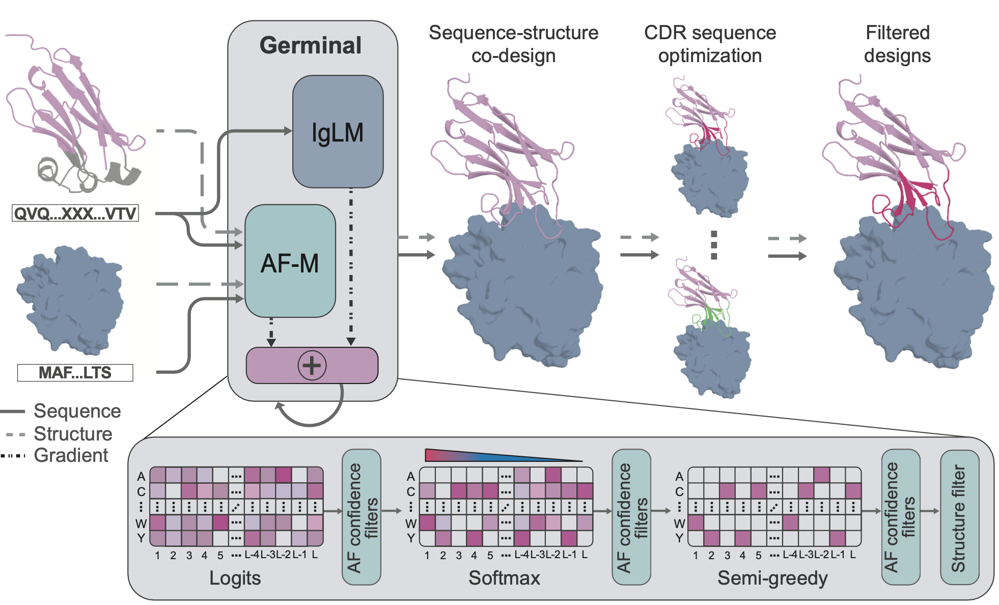

# Germinal: Efficient generation of epitope-targeted de novo antibodies

<p align="center">
  
</p>


Germinal is a pipeline for designing de novo antibodies against specified epitopes on target proteins. The pipeline follows a 3-step process: hallucination based on ColabDesign, selective sequence redesign with AbMPNN, and cofolding with a structure prediction model. Germinal is capable of designing both nanobodies and scFvs against user-specified residues on target proteins. 

We describe Germinal in the preprint: ["Efficient generation of epitope-targeted de novo antibodies with Germinal"](https://www.biorxiv.org/content/10.1101/2025.09.19.677421v1)

**⚠️ We are still actively working on code improvements.**

## Contents

<!-- TOC -->

- [Setup](#setup)
   * [Requirements](#requirements)
   * [Installation](#installation)
- [Usage](#usage)
   * [Quick Start](#quick-start)
      + [Configuration Structure](#configuration-structure)
   * [Basic Usage](#basic-usage)
   * [CLI Overrides](#cli-overrides)
   * [Target Configuration](#target-configuration)
   * [Filters Configuration](#filters-configuration)
- [Output Format](#output-format)
- [Tips for Design](#tips-for-design)
- [Citation](#citation)
- [Acknowledgments](#acknowledgments)

<!-- TOC -->

<!-- TOC --><a name="setup"></a>
## Setup

<!-- TOC --><a name="requirements"></a>
### Requirements

**Prerequisites:**
- [PyRosetta](https://www.pyrosetta.org/) (academic license required)
- [ColabDesign/AlphaFold-Multimer parameters](https://storage.googleapis.com/alphafold/alphafold_params_2022-12-06.tar) (click link for download or see below for cli)
- [AlphaFold3 parameters](https://github.com/google-deepmind/alphafold3) (optional)
- JAX with GPU support

**System Requirements:**
- **GPU**: NVIDIA GPU with CUDA support
- **Memory**: 80GB+ VRAM
- **Storage (recommended)**: 50GB+ space for results

<!-- TOC --><a name="installation"></a>
### Installation

1. Ensure you have an NVIDIA GPU with a recent driver (recommended CUDA 12+). You can verify with:
   ```bash
   nvidia-smi
   ```
2. Install Miniconda or Anaconda if not already available.

3. Follow the instructions in `environment_setup.md`

4. Copy AlphaFold-Multimer parameters to `params/` and untar them. 
   Alternatively, you can run the following lines inside `params/` to download and untar:
   ```bash
   aria2c -q -x 16 https://storage.googleapis.com/alphafold/alphafold_params_2022-12-06.tar
   tar -xf alphafold_params_2022-12-06.tar -C .
   ```

5. Activate the environment:
   ```bash
   conda activate germinal
   ```

6. (Optional) Run validation at any time to ensure all packages have installed correctly:
   ```bash
   python validate_install.py
   ```

Notes:
- AlphaFold-Multimer and AlphaFold3 parameters are large and must be downloaded manually.

<!-- TOC --><a name="usage"></a>
## Usage

<!-- TOC --><a name="quick-start"></a>
### Quick Start

The main entry point to the pipeline is `run_germinal.py`. Germinal uses [Hydra](https://hydra.cc/) for orchestrating different configurations. An example main configuration file is located in `configs/config.yaml`. This yaml file contains high level run parameters as well as pointers to more granular configuration settings.

These detailed options are stored in four main settings files:

 - **Main run settings**: `configs/run/vhh.yaml`
 - **Target settings**: `configs/target/[your_target].yaml`
 - **Post-hallucination (initial) filters**: `configs/filter/initial/default.yaml`
 - **Final filters**: `configs/filters/final/default.yaml`

<!-- TOC --><a name="configuration-structure"></a>
#### Configuration Structure

```
configs/
├── config.yaml              # Main configuration yaml
├── run/                     # Main run settings
│   ├── vhh.yaml             # VHH (nanobody) specific settings
│   └── scfv.yaml            # scFv specific settings
├── target/                  # Target protein configurations
│   └── pdl1.yaml            # PDL1 target example
└── filter/                  # Filter configurations
    ├── initial/
    │   └── default.yaml     # Post-hallucination (initial) filters
    └── final/
        ├── default.yaml     # Final acceptance filters
        └── scfv.yaml        # Final filters for scfv runs
```

In general, the main run settings and filters should stay the same and can be run as defaults unless you are experimenting. To design nanobodies targeting PD-L1, simply run:

```bash
python run_germinal.py
```

To design scFvs targeting PD-L1, run:

```bash
python run_germinal.py run=scfv filter.initial=scfv
```

If you wish to change the configuration of runs, you can:

 - create an entirely new config yaml
 - swap one of the four main settings files
 - pass specific overrides

<!-- TOC --><a name="basic-usage"></a>
### Basic Usage

**Run with defaults (VHH + PDL1 + default filters):**
```bash
python run_germinal.py
```

**Switch to scFv:**
```bash
python run_germinal.py run=scfv
```

**Use different target:**
```bash
python run_germinal.py target=my_target
```

**Use a different config file with Hydra:**
```bash
python run_germinal.py --config_name new_config.yaml
```

<!-- TOC --><a name="cli-overrides"></a>
### CLI Overrides

Hydra provides powerful CLI override capabilities. You can override any parameter in any configuration file.

> [!NOTE]
> Settings in `configs/run/` folder use the global namespace and do not need a `run` prefix before overriding. See example below.

**Basic parameter overrides:**
```bash
# Override trajectory limits
python run_germinal.py max_trajectories=100 max_passing_designs=50

# Override experiment settings
python run_germinal.py experiment_name=my_experiment run_config=test_run

# Override loss weights. Note: no run prefix since run settings are global
python run_germinal.py weights_plddt=1.5 weights_iptm=0.8 
```

**Filter threshold overrides:**
```bash
# Make initial filters less stringent
python run_germinal.py filter.initial.clashes.value=2

# Adjust final filter thresholds
python run_germinal.py filter.final.external_plddt.value=0.9 filter.final.external_iptm.value=0.8

# Change filter operators
python run_germinal.py filter.final.sc_rmsd.operator='<=' filter.final.sc_rmsd.value=5.0
```

**Target configuration overrides:**
```bash
# Change target hotspots
python run_germinal.py target.target_hotspots="A26,A30,A36,A44"

# Use different PDB file
python run_germinal.py target.target_pdb_path="pdbs/my_target.pdb" target.target_name="my_target"
```

**Complex multi-parameter overrides:**
```bash
# Complete scFv run with custom settings
python run_germinal.py \
  run=scfv \
  target=pdl1 \
  max_trajectories=500 \
  experiment_name="scfv_pdl1_test" \
  target.target_hotspots="A37,A39,A41" \
  filter.final.external_plddt.value=0.85 \
  weights_iptm=1.0
```


<!-- TOC --><a name="target-configuration"></a>
### Target Configuration

For each new target, you will need to define a target settings yaml file which contains all relevant information about the target protin. Here is an example:

```yaml
target_name: "pdl1"
target_pdb_path: "pdbs/pdl1.pdb"
target_chain: "A"
binder_chain: "B"
target_hotspots: "25,26,39,41"
dimer: false  # support coming soon!
length: 133
```

<!-- TOC --><a name="filters-configuration"></a>
### Filters Configuration

There are two sets of filters: post-hallucination (initial) filters and final filters. The post-hallucination filters are applied after the hallucination step to determine which sequences to proceed to the redesign step. This filter set is a subset of the final filters, which is applied at the end of the pipeline to determine passing antibody sequences. Here is an example of the post-hallucination filters:
```yaml
clashes: {'value': 1, 'operator': '<'}
cdr3_hotspot_contacts: {'value': 0, 'operator': '>'}
percent_interface_cdr: {'value': 0.5, 'operator': '>'}
interface_shape_comp: {'value': 0.6, 'operator': '>'}
```

<!-- TOC --><a name="output-format"></a>
## Output Format

Germinal generates organized output directories:

```
runs/your_target_nb_20240101_120000/
├── final_config.yaml           # Complete run configuration after overrides
├── trajectories/               # Results for trajectories which pass hallucination but fail the first set of filters
│   ├── structures/     
│   ├── plots/            
│   └── designs.csv      
├── redesign_candidates/        # Results for trajectories which are AbMPNN redesigned but fail the final set of filters
│   ├── structures/          
│   └── designs.csv           
├── accepted/                   # Antibodies that pass all filters
│   ├── structures/          
│   └── designs.csv           
├── all_trajectories.csv        # Main CSV containing designs in all three folders above
└── failure_counts.csv          # CSV logging # trajectories failing each step of hallucination
```

**Key Output Files:**
- `accepted/structures/*.pdb` - Final antibody-antigen structure for passing antibody designs.
- `all_trajectories.csv` - Complete list of designs that passed hallucination, their *in silico* metrics, which stage they reached, and the pdb path to the designed structure.

<!-- TOC --><a name="tips-for-design"></a>
## Tips for Design

Hallucination is inherently expensive. Designing against a 130 residue target takes anywhere from 3-8 minutes for a nanobody design iteration, depending on which stage the hallucinated sequence reaches. For scFvs, this number is around 50% larger.

During sampling, we typically run antibody generation until there are around 1,000 passing designs against the specified target. Of those, we typically select the top 40-50 sequences for experimental testing based on a combination of *in silico* metrics described in the preprint. While *in silico* success rates vary wildly across targets, we estimate that 200-300 H100 80GB GPU hours of sampling are typically enough to discover some functional antibodies. 

More tips coming soon!

<!-- TOC --><a name="citation"></a>
## Citation

If you use Germinal in your research, please cite:

```bibtex
@article{mille-fragoso_efficient_2025,
	title = {Efficient generation of epitope-targeted de novo antibodies with Germinal},
   author = {Mille-Fragoso, Luis Santiago and Wang, John N. and Driscoll, Claudia L. and Dai, Haoyu and Widatalla, Talal M. and Zhang, Xiaowe and Hie, Brian L. and Gao, Xiaojing J.},
	url = {https://www.biorxiv.org/content/10.1101/2025.09.19.677421v1},
	doi = {10.1101/2025.09.19.677421},
	publisher = {bioRxiv},
	year = {2025},
}
```

<!-- TOC --><a name="acknowledgments"></a>
## Acknowledgments

Germinal builds upon the foundational work of previous hallucination-based protein design pipelines such as ColabDesign and BindCraft and this codebase incorporates code from both repositories. We are grateful to the developers of these tools for making them available to the research community. 

**Related Work:**
If you use components of this pipeline, please also cite the underlying methods:

- **ColabDesign**: [https://github.com/sokrypton/ColabDesign](https://github.com/sokrypton/ColabDesign)
- **IgLM**: [https://github.com/Graylab/IgLM](https://github.com/Graylab/IgLM)
- **Chai-1**: [https://github.com/chaidiscovery/chai-lab](https://github.com/chaidiscovery/chai-lab)
- **AlphaFold3**: [https://github.com/google-deepmind/alphafold3](https://github.com/google-deepmind/alphafold3)
- **AbMPNN**: [Dreyer, F. A., Cutting, D., Schneider, C., Kenlay, H. & Deane, C. M. Inverse folding for
antibody sequence design using deep learning. (2023).](https://www.biorxiv.org/content/10.1101/2025.05.09.653228v1.full.pdf)
- **PyRosetta**: [https://www.pyrosetta.org/](https://www.pyrosetta.org/)

## License

This repository is licensed under the [Apache License 2.0](LICENSE).

### External Dependencies

Some components require separate licenses that are not included in this repository:

- **IgLM**: Provided under a non-commercial academic license from Johns Hopkins University.  
  See their documentation for details.  
- **PyRosetta**: Provided by the Rosetta Commons and University of Washington under a non-commercial, non-profit license.  
  PyRosetta cannot be redistributed and must be obtained separately.  
  Commercial use requires a separate license. See [https://www.pyrosetta.org](https://www.pyrosetta.org).
